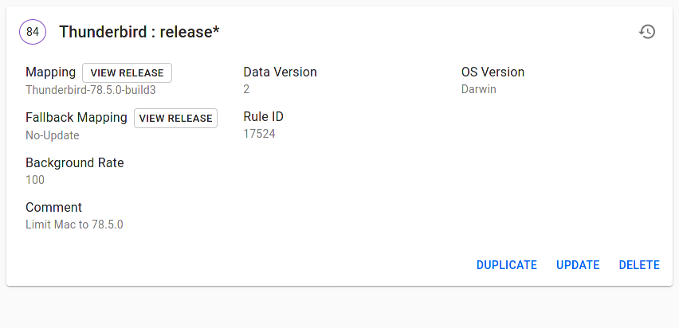

Halt macOS updates at a version
===========================

This halts all macOS updates at 78.5.0-build3. The rule priority must be set so that the version will match where it needs to in the chain. `OS Version`is a partial match rule, so "Darwin" will catch all macOS versions, including Big Sur (macOS 11).

For the future, I would not use a wildcard rule like `release*` so that it works on release-localtest, release-cdntest, and release. This has made testing the update to 78.6.0 where there is a fix for the bug that necessitated this halt difficult for the macOS testers. Create separate rules for each channel, or possibly don't create rules at all on -localtest and -cdntest.